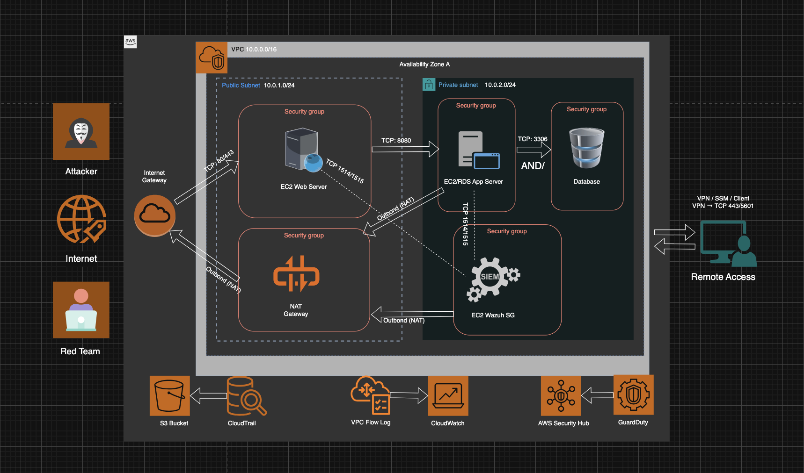

# High-Level Architecture

### Overview

This architecture is designed to simulate a production-style cloud environment that supports both NOC and SOC operations.

The goal is not to build every advanced feature at once, but to establish a secure baseline architecture that allows monitoring, logging, detection, and controlled attack simulation.

Due to budget considerations, some components may be implemented incrementally. However, the core security and operational principles will remain aligned with industry best practices.

> _Note: The architecture may evolve as the project matures and additional controls are implemented._

### VPC and Network Design

The environment is deployed inside a dedicated AWS VPC with proper network segmentation.

##### Subnet Structure

1. Public Subnet(s)
   - Hosts internet-facing services (EC2 Web Server – Ubuntu, t3.micro).
   - Connected to an Internet Gateway.
   - Security Groups allow only required inbound traffic (HTTP/HTTPS or specific test ports).

2. Private Subnet(s)
   - Hosts internal services such as application servers or databases (EC2 or RDS).
   - No direct internet exposure.
   - Access restricted via Security Groups (only allowed from specific source security groups).

##### Network Controls

- Route Tables configured for controlled traffic flow.
- NAT Gateway used when private instances require outbound internet access (updates, packages).
- Security Groups used for instance-level segmentation.
- Network ACLs configured to follow baseline security rules.

This segmentation ensures separation between exposed services and internal resources, following the principle of least privilege.

### Logging and Monitoring Layer

The logging and monitoring layer provides visibility for both operational and security use cases.

##### Logging Components

- AWS CloudTrail
  - Enabled for management events.
  - Logs stored centrally for audit and investigation.

- VPC Flow Logs
  - Enabled and sent to CloudWatch Logs.
  - Used to analyze network traffic patterns and detect anomalies.

##### Threat Detection Services

- Amazon GuardDuty
  - Enabled for threat detection (malicious IPs, anomalous behavior, reconnaissance patterns).

- AWS Security Hub
  - Centralizes security findings from GuardDuty and other services.
  - Provides aggregated security visibility.

This layer supports SOC-style investigation workflows and enables future detection engineering.

### SIEM / Dashboard / Alerting Layer

To simulate centralized log analysis, a lightweight SIEM platform is deployed:

- Wazuh (Ubuntu EC2 – t3.micro)
  - Used for log aggregation and visualization.
  - Can receive logs from monitored instances and integrate with AWS log sources.

Agents on Web/App EC2s connect outbound to Wazuh private IP:1514 (events) and 1515 (enrollment).

CloudWatch is used for:

- Metric collection.
- Alert configuration.
- Basic operational dashboards.

> _Note: Due to resource constraints, only one primary dashboard/analysis platform may be active at a time._

### Attack Simulation Approach

Attack simulation will be conducted from an external controlled environment, rather than hosting attacker infrastructure inside the production VPC to reflects real-world threat models, where attacks originate from outside the organization’s network.

The objective of attack simulation is validation:

- Validate logging coverage.
- Validate detection capability.
- Validate alert accuracy.

### Security Design Principles

This architecture is built with:

- Network segmentation.
- Principle of least privilege.
- Centralized logging.
- Layered monitoring.
- Controlled exposure of public services.
- Audit visibility through API logging.

Even if deployed at small scale, the structure follows patterns used in real cloud environments.

### What This Achieves

This architecture supports:

- NOC-style infrastructure monitoring.
- SOC-style event investigation.
- Log-based detection development.
- Controlled threat simulation.
- Progressive security maturity.
