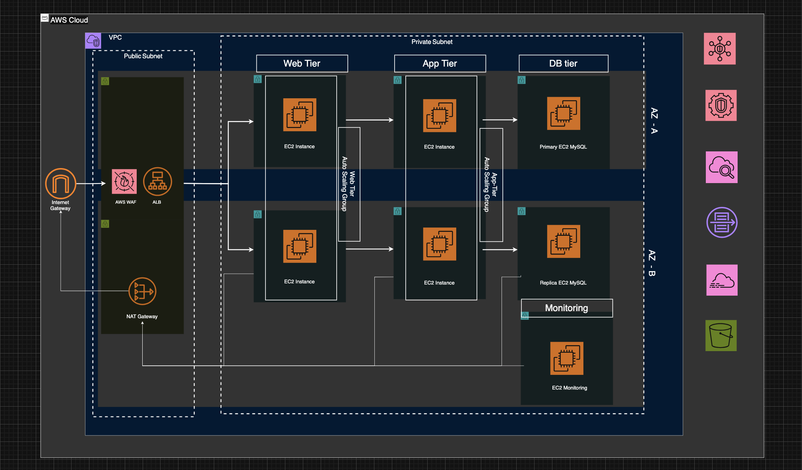

# High-Level Architecture

_Figure 1: Multi-tier, multi-AZ architecture with ALB + WAF entry point, strict tiered segmentation, regional NAT outbound, and isolated monitoring subnet for SOC visibility._

---

### Overview

This architecture is designed to simulate a production-style cloud environment that supports both NOC and SOC operations.

The goal is not to build every advanced feature at once, but to establish a secure baseline architecture that allows monitoring, logging, detection, and controlled attack simulation.

Due to budget considerations, some components may be implemented incrementally. However, the core security and operational principles remain aligned with industry best practices.

> _Note: The architecture may evolve as the project matures and additional controls are implemented._

### VPC and Network Design

The environment is deployed inside a dedicated AWS VPC with proper network segmentation.

##### Availability Zone

Deployed across two Availability Zones for high availability and fault tolerance.

- Resources (web, app, DB instances) are distributed to eliminate single points of failure.
- NAT Gateway configured for regional mode (introduced Nov 2025) to provide automatic multi-AZ expansion without managing per-AZ gateways.

##### Subnet Structure

1. Public Subnets (one per AZ)
   - Host internet-facing components: Application Load Balancer (ALB) and NAT Gateway (zonal fallback if needed).
   - Connected to Internet Gateway.
   - AWS WAF attached to ALB provides first-line web application protection (L7 filtering).

2. Private Subnets — Tiered for defense-in-depth
   - Web Tier — Hosts EC2 web servers (auto-scaling group), reachable only from ALB.
   - App Tier — Hosts EC2 application servers (auto-scaling group), reachable only from web tier.
   - DB Tier — Hosts primary and replica MySQL (EC2-based), reachable only from app tier.
   - Monitoring Tier — Isolated subnet for SIEM/security monitoring instance, receives logs from all tiers.
   - No direct internet exposure; outbound internet via NAT Gateway only.
   - Access strictly controlled via reference-based Security Groups (least privilege).

##### Network Controls

- Route Tables configured for controlled traffic flow.
- NAT Gateway used when private instances require outbound internet access (updates, packages).
- Security Groups used for instance-level segmentation.
- Network ACLs for baseline deny-all rules planned for additional subnet-level control (currently using Security Groups as primary enforcement).

This segmentation ensures separation between exposed services and internal resources, following the principle of least privilege.

### Logging and Monitoring Layer

The logging and monitoring layer provides visibility for both operational and security use cases.

##### Logging Components

- AWS CloudTrail
  - Enabled for management events.
  - Logs stored centrally for audit and investigation.

- VPC Flow Logs
  - Enabled and sent to CloudWatch Logs.
  - Used to analyze network traffic patterns and detect anomalies.

##### Threat Detection Services

- Amazon GuardDuty
  - Enabled for threat detection (malicious IPs, anomalous behavior, reconnaissance patterns).

- AWS Security Hub
  - Centralizes security findings from GuardDuty and other services.
  - Provides aggregated security visibility.

This layer supports SOC-style investigation workflows and enables future detection engineering.

### SIEM / Dashboard / Alerting Layer

A dedicated private monitoring subnet hosts a security monitoring instance (Wazuh/Splunk) that simulates centralized log aggregation and analysis.

CloudWatch complements this with:

- Metric collection from EC2, ALB, RDS/EC2 DB, NAT Gateway.
- Custom alarms for availability and security thresholds.
- Basic NOC dashboards for resource health and uptime.

> _Note: Due to resource constraints, only one primary dashboard/analysis platform may be active at a time._

### Attack Simulation Approach

Attack simulation will be conducted from an external controlled environment, rather than hosting attacker infrastructure inside the production VPC. This reflects real-world threat models, where attacks originate from outside the organization’s network.

The objective of attack simulation is validation:

- Validate logging coverage.
- Validate detection capability.
- Validate alert accuracy.

### Security Design Principles

This architecture is built with:

- Network segmentation.
- Principle of least privilege.
- Centralized logging.
- Layered monitoring.
- Controlled exposure of public services.
- Audit visibility through API logging.

Even if deployed at a small scale, the structure follows patterns used in real cloud environments.

### What This Achieves

This architecture supports:

- NOC-style infrastructure monitoring.
- SOC-style event investigation.
- Log-based detection development.
- Controlled threat simulation.
- Progressive security maturity.

---

### Key Design Decisions & Trade-offs

- Regional NAT Gateway (2025 feature) — Chosen for automatic HA and simplified routing (single route table for all private subnets).
- EC2-based MySQL (instead of RDS) — Allows full control for attack simulation / detection testing while keeping costs low.
- Single monitoring instance — Budget constraint; production would use multi-AZ or managed SIEM (e.g., Amazon OpenSearch + Security Analytics).
- No public SSH — All access via AWS Systems Manager Session Manager.
- Future phases — Add NACLs, VPC Endpoints (S3, CloudWatch), AWS Config rules, and automated detection playbooks.
