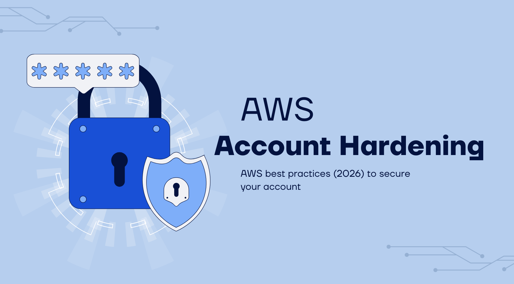
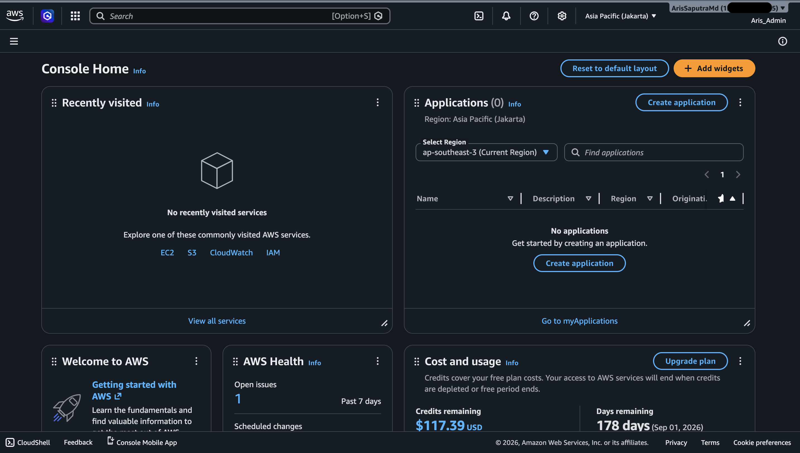
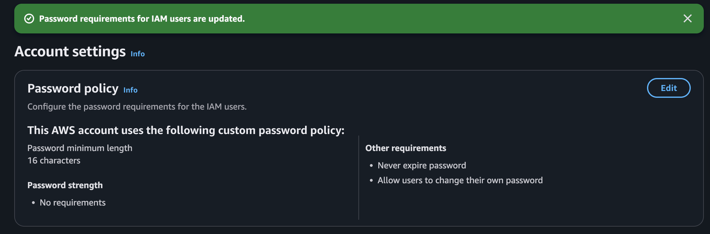
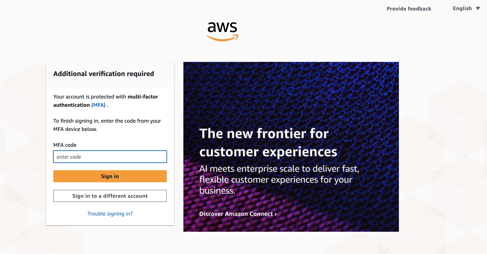

## AWS Account Hardening

  
\*_Figure 1: AWS account hardening banner_

---

In Phase 1, I implemented multiple layers of security controls to protect AWS account credentials and prevent unauthorized access. These measures follow current AWS best practices (2026) and align with the AWS Well-Architected Security Pillar.

AWS supports several identity types:

- Root user — the account owner with unrestricted access (use only when absolutely necessary).
- IAM Identity Center users — recommended for workforce / human access.
- Federated principals — temporary access via external identity providers (e.g., Okta, Entra ID).
- IAM users — legacy / direct users (avoid where possible; use sparingly).

### Key Best Practices I Followed

**1. Created an Administrator IAM User (Do NOT use root user daily)**  
To minimize risk, I avoid performing daily operations with the root user. Instead, I:

- Created an IAM administrator user.
- Assigned the `AdministratorAccess` managed policy (or a custom permission set with equivalent privileges).
- Sign in exclusively with this administrator user for all administrative tasks.

    
   \*_Figure 2: AWS Management Console after successful login with the Administrator IAM user._

**2. Secured the AWS Account**

- **Password policy**  
  Following modern guidelines (NIST SP 800-63B influence + AWS recommendations), I configured a custom IAM password policy with:
  - Minimum length: 16 characters.
  - No mandatory complexity rules (uppercase, numbers, symbols) — favoring long, memorable passphrases.
  - Passwords never expire (no forced periodic rotation).
  - Users allowed to change their own passwords.

  This approach encourages strong, unique passphrases managed via a password manager (which handles hashing and salting internally).

    
  \*_Figure 3: Configured IAM password policy._

- **Multi-Factor Authentication (MFA)**  
  Enabled MFA on the root user immediately for phishing-resistant protection. I registered multiple devices for resiliency:
  - Preferred: Passkey or FIDO2 security key (strongly recommended by AWS)
  - Acceptable fallback: Hardware TOTP token or authenticator app (e.g., Authy)

    
  \*_Figure 4: MFA verification during login process._

- **Root user credential hygiene**
  - Never created or used access keys for the root user — deleted any if they existed previously.
  - Use the root user only for rare, emergency tasks (e.g., account closure, enabling AWS Organizations, changing billing settings).

**3. Avoided Long-Term Access Keys Where Possible**  
Long-term access keys (access key ID + secret access key) do not expire automatically and are a frequent breach vector.

- Preferred approach: Use temporary credentials whenever possible
  - IAM roles for EC2 instances, Lambda, ECS, etc.
  - IAM Identity Center (SSO) for human users
- For the rare cases where long-term keys are unavoidable (legacy tools only):
  - Rotate them regularly (at least every 90 days)
  - Apply least privilege scope
  - Monitor usage via IAM "last accessed" information
  - Delete unused or stale keys immediately

**4. Additional Controls Implemented**

- Used IAM Access Analyzer to identify unused permissions and refine policies.
- Applied least privilege everywhere — started with AWS managed policies, then customized as needed.
- Planned for future: AWS Organizations + Service Control Policies (SCPs) once moving beyond single-account / free-tier constraints.

---

### Outcome & Skills Demonstrated

This hardening process significantly reduces the risk of credential compromise and establishes a secure foundation for the NOC/SOC simulation environment built in later phases.

Through this work, I demonstrated practical understanding of:

- Modern cloud identity management
- Root vs. IAM user security models
- Phishing-resistant MFA strategies
- Balanced password policy configuration
- Least-privilege principles

These are critical competencies for roles such as Cloud Security Engineer, SOC Analyst, Cloud NOC Analyst, or Junior Detection Engineer.
