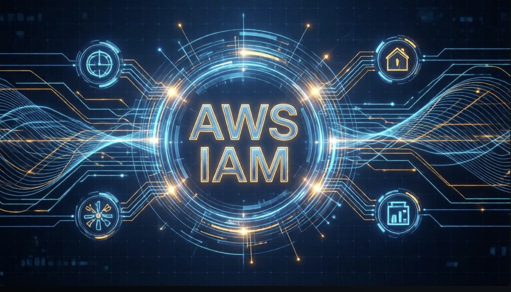
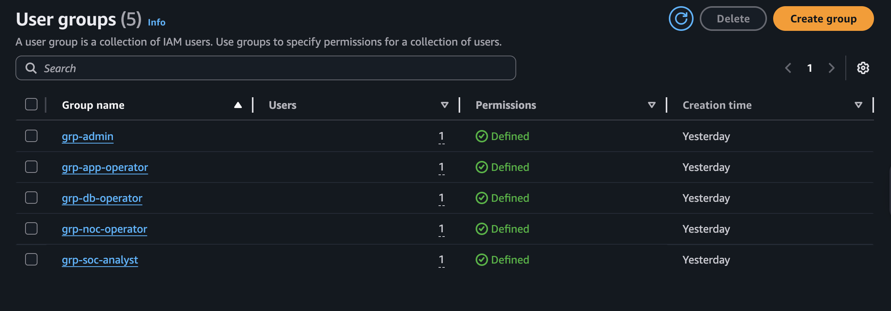
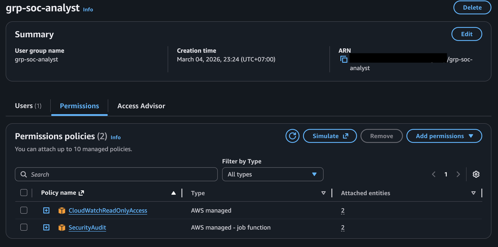
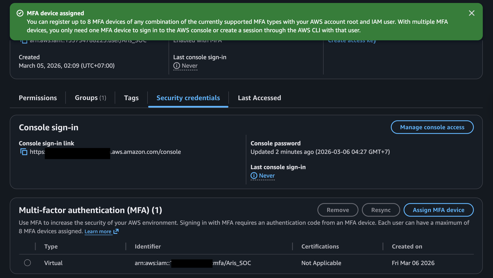
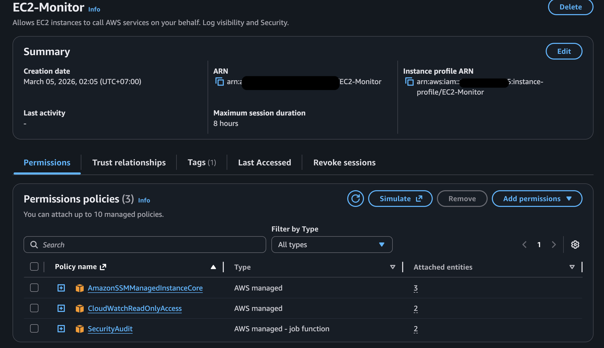

## IAM Baseline

 \*_Figure 1: AWS IAM banner_

---

#### Modern AWS Recommendation (2026)

AWS strongly recommends AWS IAM Identity Center (organization instance) for human workforce access. It delivers:

- Temporary credentials via role assumption (no long-lived access keys or console passwords in AWS)
- Centralized permission sets that map to roles (least privilege at scale)
- Built-in MFA enforcement
- Single sign-on portal for AWS console + supported apps
- Easy auditing and revocation

This is the preferred pattern for production environments, especially multi-account setups with AWS Organizations.

#### Decision for This Portfolio Lab

This is a single-account, personal project focused on secure architecture, logging, monitoring, threat detection, and cost control during early phases.

Enabling AWS Organizations (required for full IAM Identity Center features like permission sets and console SSO) would immediately upgrade the account to Paid plan, expire remaining Free Tier credits, and remove eligibility for future credits. To maximize Free Tier usage while building and running the core environment (EC2 instances, NAT Gateway, RDS, GuardDuty, Security Hub, Wazuh), I **intentionally** retained direct IAM users + role-based groups with custom policies.

This approach allows clear demonstration of:

- Principle of least privilege through granular, custom policies
- Role separation (e.g., admin vs. SOC analyst vs. NOC monitoring permissions)
- Without introducing unnecessary services or budget risk in Phase 1

#### Key Controls Implemented

**Groups & Least Privilege**

- Created dedicated groups: admin-full, soc-analyst, noc-monitoring, app-operator, and db-operator.

   \*_Figure 2: Preview User Group List_

- Attached custom customer-managed policies (avoided broad AWS-managed policies like AdministratorAccess)
  - SOC analyst example: Read-only access to investigation tools  
    Allowed actions: `guardduty:List*`, `guardduty:Get*`, `securityhub:Describe*`, `securityhub:Get*`, `securityhub:BatchGet*`, `logs:DescribeLogGroups`, `logs:GetLogEvents`, `cloudtrail:LookupEvents`, `cloudtrail:Get*`  
    Denied: Any write, delete, configuration change, or IAM management actions unless explicitly required
  - NOC monitoring example: Focused on CloudWatch metrics/alarms, EC2 status, no security write access
- Default deny + explicit allow pattern enforced
- Policies attached only to groups, not individual users

   \*_Figure 3: Preview Example of Attached user group policy - (source: grp-soc-analyst)_

**Credential & Root Security**

- MFA enforced on all IAM users (virtual MFA device / authenticator app required)
- NIST password policy guideline applied: minimun 16 characters
- Root user: MFA enabled, no daily console usage, no access keys created, limited to emergency/billing tasks only
- No long-term access keys used for human access (console + MFA only)

   \*_Figure 4: Configured MFA_

**IAM Roles for Workloads (Instance Profiles)**

- EC2 instances (Web, App, Wazuh) use instance profiles with minimal policies
  - Examples: `CloudWatchAgentServerPolicy`, `AmazonSSMManagedInstanceCore`, custom read/write to specific S3 buckets/CloudWatch Logs for agents
- Temporary credentials only — no static keys embedded in code or config

  
  \*Figure 5: Preview EC2-Monitor role and it attached policy\*\*

---

#### Future Improvement Path

In later phases (e.g., Phase 3–4 or when simulating multi-account), I plan to:

- Create a AWS Organization account + full IAM Identity Center demo
- Document migration steps from legacy IAM → permission sets
- Compare access patterns (long-lived vs. temporary credentials)

This baseline provides production-grade security hygiene within lab constraints, clearly demonstrates least-privilege concepts, and reflects real-world engineering trade-offs (security vs. cost/timeline) — essential skills for NOC Analyst/Technician, SOC Analyst (Tier 1/2), and Junior Cloud Security Engineer roles.
