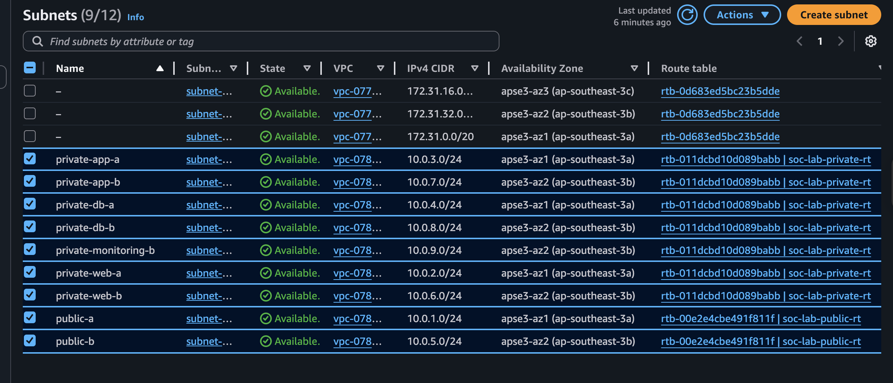
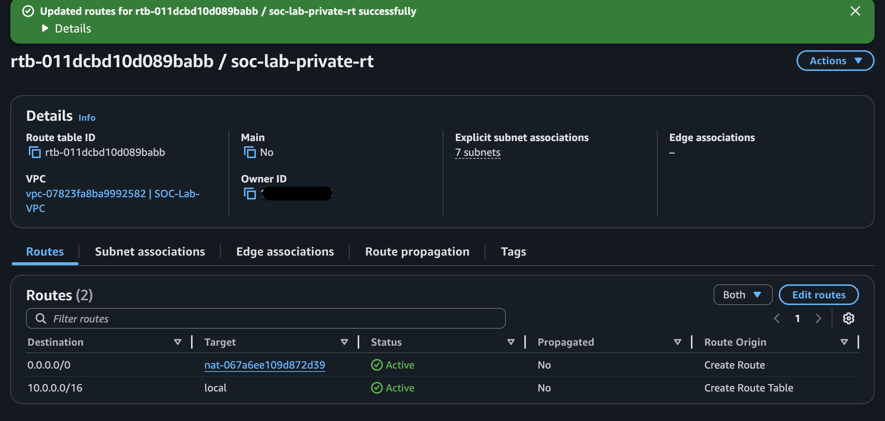
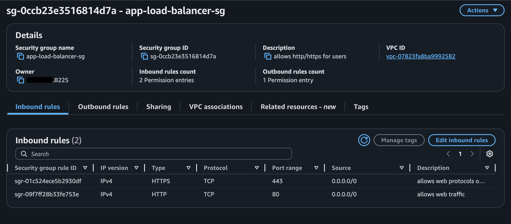

## VPC Design and Network Segmentation

_Figure 1: Overall architecture showing tiered segmentation, multi-AZ layout, ALB entry point, NAT outbound, and isolated monitoring subnet_

---

#### Objectives

Deploy a custom VPC with proper multi-AZ network segmentation to simulate secure production-like NOC (availability, monitoring) and SOC (detection, isolation, logging) operations.

#### Key Design Principles

- Multi-AZ resilience across `ap-southeast-3a` and `ap-southeast-3b`.
- Strict tiered isolation: Public > Private Web > Private App > Private DB > Monitoring.
- Least-privilege access via reference-based security groups.
- Outbound-only internet for private subnets via NAT Gateway.
- Centralized monitoring in a dedicated subnet for SIEM.

#### VPC Fundation

- Tag Name : SOC-Lab-VPC.
- IPv4 CIDR : 10.0.0.0/16.
- Region: Asia Pasific (Jakarta).
- Availiability Zone: `ap-southeast-3a`, `ap-southeast-3b`.
- Internet Gateway
- NAT Gateway:
  - Public IP = - ElasticIP
  - Private IP = 10.0.5.20
  - Subnet = public-subnet-b
    > Single NAT in AZ-b chosen for cost optimization in lab (~$32/mo savings vs. dual). In production, Regional AZ provides automatic multi-AZ high availability without requiring you to manage multiple NATs or route tables. Cost scales with active AZs (~equivalent to 2 zonal NATs in this design).

#### Subnet Layout & Tiering

To provide confidentiality and availability, I've segmented my VPC by creating:

- 2 Availability Zone - Spread the resources and subnet across Availability Zones. Prevent single of failure.
- Public subnets - Internet-facing subnet (ALB and NAT) and first defence AWS WAF.
- 3-tier of private subnets - Web, App, and Database, this provides defence in-depth by segmenting each layer.
- Monitoring the subnet for central logs collection and security monitoring.

  
  _Figure 2: Console view of subnets with AZ spread and route table associations_

#### Routing & Traffic Flow

- Public route table → IGW
- Private route tables → NAT
- No direct internet from private subnets

  
  _Figure 3: Private subnet route table pointing to NAT Gateway_

#### Security Groups – Network Segmentation Rules

| Tag Name             | Inbound Rules                                              | Outbound Rules   |
| -------------------- | ---------------------------------------------------------- | ---------------- |
| sg-app-load-balancer | source: 0.0.0.0/0                                          | dest: 0.0.0.0/0  |
|                      | protocol/port: HTTP/80; HTTPS/443                          | protocol/port: ~ |
| sg-web-servers       | source: `sg-app-load-balancer`                             |
|                      | protocol/port: TCP/8080                                    | protocol/port: ~ |
| sg-app-servers       | source: `sg-web-servers`                                   | dest: 0.0.0.0/0  |
|                      | protocol/port: TCP/8080                                    | protocol/port: ~ |
| sg-database          | source: `sg-app-servers`                                   | dest: 0.0.0.0/0  |
|                      | protocol/port: TCP(3306/5432)                              | protocol/port: ~ |
| sg-monitoring        | source: `sg-web-servers`; `sg-app-servers`; `sg-database`; | dest: 0.0.0.0/0  |
|                      | protocol/port: TCP/UDP(1514); TCP/1515;                    | protocol/port: ~ |

> Future plan to implementing NACL for network-level restrictions.

_Figure 4: Example of reference-based rule (source = sg-app-load-balancer)_

#### Additional Network Controls

- VPC Flow Logs enabled (flow logs > cloudwatch > EC2 monitoring)
- AWS WAF on ALB
- SSM Session Manager for main access
- Open SSH on the monitoring instance (for demo purposes only)
- VPC Endpoints for S3 / CloudWatch / GuardDuty

#### Cost & Trade-off Summary

- Single NAT Gateway: ~$32/mo savings vs dual
- Graviton instances: ~20–40% cheaper
- Monitoring instance oversized for demo
- Mitigation: stop/start instances + Budgets alarms

---

#### Lessons Learned & Future Improvements

- Single NAT chosen for budget (next step: regional AZ NAT).
- Planned to implement NACLs for subnet-level deny rules in production
- Migrate to the regional NAT Gateway when the feature matures in ap-southeast-3
