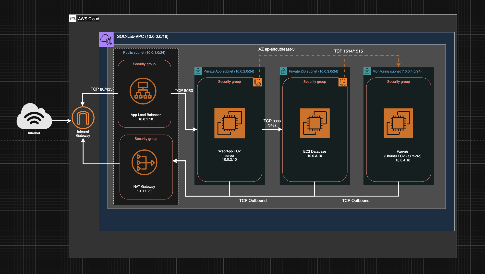

<!-- >Restrict bastion SG to your IP only"Bastion for lab access; in production, I'd use SSM to eliminate public SSH."
> "Designed for multi-AZ; implemented single AZ to save costs/time."
>App → DB (e.g., 3306/5432) — ensure SG allows only from app SG -->

## VPC Design

**Objectives: Create VPC custom and it's component that capable to simulate both SOC and NOC operation.**

VPC is Designed for multi-AZ but I implemented single AZ to save costs/time. Below is spesification of VPC and it's feature I've design:

- VPC
  - IPv4 CIDR : 10.0.1.0/16.
  - Tag Name : SOC-Lab-VPC.
  - AZ : ap-southeast-3a.

- Internet Gateway
  - Tag name : soc-lab-igw.

- NAT Gateway
  - Tag name : southeast-3a-nat-gateway.
  - Primary Public IPv4 address : 16.79.166.182.
  - Primary Public IPv4 address : 10.0.1.20.
  - Subnet : public-subnet.

- EC2
