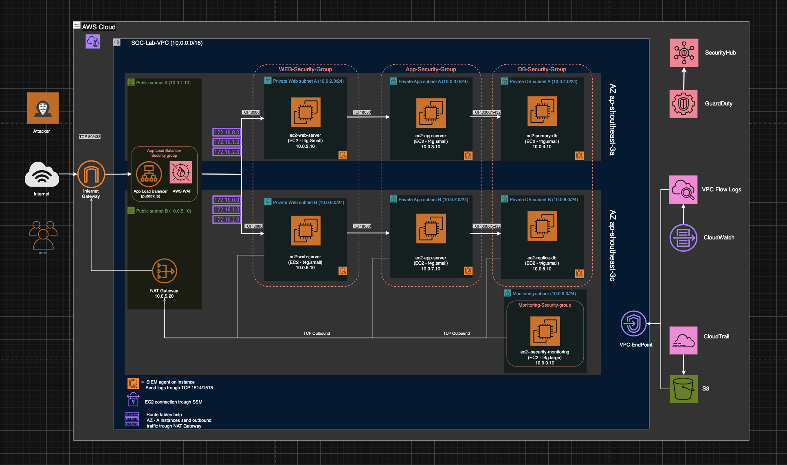

<!-- >Restrict bastion SG to your IP only"Bastion for lab access; in production, I'd use SSM to eliminate public SSH."
> "Designed for multi-AZ; implemented single AZ to save costs/time."
>App → DB (e.g., 3306/5432) — ensure SG allows only from app SG -->

## VPC Design

**Objectives: VPC custom and it's component with proper network segmentation, capable to simulate both SOC and NOC operation.**

VPC and feature design spesification:

- Region: Asia Pasific (Jakarta).

- Availiability Zone: `ap-southeast-3a`, `ap-southeast-3c`

  > VPC is Designed for multi-AZ, implemented single AZ to save costs/time.

- VPC
  - Tag Name : SOC-Lab-VPC.
  - IPv4 CIDR : 10.0.0.0/16.
  - AZ : ap-southeast-3a.

- Public Subnet
  - Tag Name : public-subnet.
  - CIDR : 10.0.1.0/24.

- Private Web/App Subnet
  - Tag Name : private-web/app-subnet.
  - CIDR : 10.0.2.0/24.

- Private Database Subnet
  - Tag Name : private-db-subnet.
  - CIDR : 10.0.3.0/24.

- Private Monitoring Subnet
  - Tag Name : monitoring-subnet.
  - CIDR : 10.0.4.0/24.

- Internet Gateway
  - Tag name : soc-lab-igw.

- NAT Gateway
  - Tag name : southeast-3a-nat-gateway.
  - Public IP : ##.##.###.#82
  - Private IP : 10.0.1.20.
  - Subnet : public-subnet.

- Application Load Balancer
  - Name : app-load-balancer.
  - Public IP : ##.###.##.12.
  - Private IP: 10.0.1.10.
  - Scheme : Internet-facing.
  - Ip Type : IPv4.
  - Subnet : public-subnet.
  - Security Group : app-load-balancer-sg.
  - listener : HTTPS/443 (forward), HTTP/80 (redirect to URL).
  - Target-Group: soc-lab-internal-services.
- Web/App Server
  - Tag Name : ec2-web/app-server.
  - IPv4 Address : 10.0.2.135.
  - AMI : Ubuntu server 22.04 LTS(HVM).
  - Architecture : 64-bit(ARM)
  - Instance Type : t4g.micro, 2vCPU, 1GB memory.
  - Key Pair : RSA, .pem.
  - Storage : 1 volum(s) - 8GiB
  - Delete on Termination: enabled.
  - Security Group : web-app-server-sg.

- Databse Server
  - Tag Name : ec2-web/app-server-ubuntu22.04.
  - IPv4 Address : 10.0.2.135.
  - AMI : Ubuntu server 22.04 LTS(HVM).
  - Architecture : 64-bit(ARM)
  - Instance Type : t4g.micro, 2vCPU, 1GB memory.
  - Key Pair : RSA, .pem.
  - Storage : 1 volum(s) - 8GiB
  - Delete on Termination: enabled.
  - Security Group : web-app-server-sg.

- Monitoring Instance
  - Tag Name : ec2-web/app-server-ubuntu22.04.
  - IPv4 Address : 10.0.2.135.
  - AMI : Ubuntu server 22.04 LTS(HVM).
  - Architecture : 64-bit(ARM)
  - Instance Type : t4g.micro, 2vCPU, 1GB memory.
  - Key Pair : RSA, .pem.
  - Storage : 1 volum(s) - 8GiB
  - Delete on Termination: enabled.
  - Security Group : web-app-server-sg.

- Security Group
  - app-load-balancer-sg :
    - inbound rules: source: 0.0.0.0/0 ~ http/80,https/443,.
    - outbound rules : dest: 0.0.0.0/0
  - web-app-server-sg :
    - inbound rules: source: app-load-balancer-sg, tcp/8080.
    - outbound rules : dest: 0.0.0.0 ~ any.
  - database-sg:
    - inbound rules: source: web-app-server-sg, tcp/3306.
    - outbound rules : dest: 0.0.0.0 ~ any.
  - wazuh-ec2-sg
    - inbound rules: source: web-app-server-sg, tcp/1514,tcp1515.
    - inbound rules: source: wazuh-ec2-sg, tcp/1514,tcp1515.
    - outbound rules : dest: 0.0.0.0 ~ any.

- Routing Table

expected service cost:
