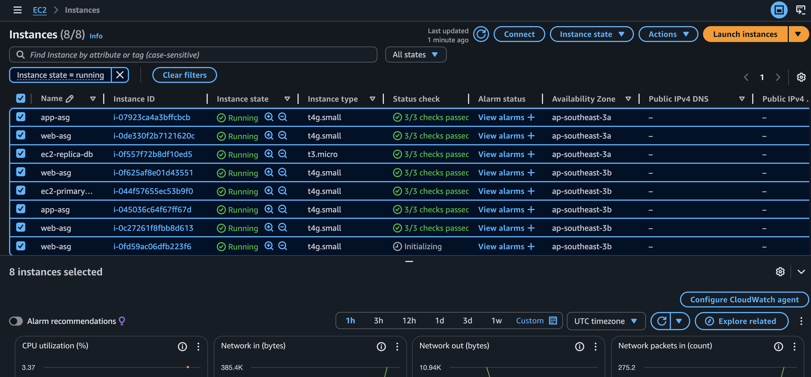
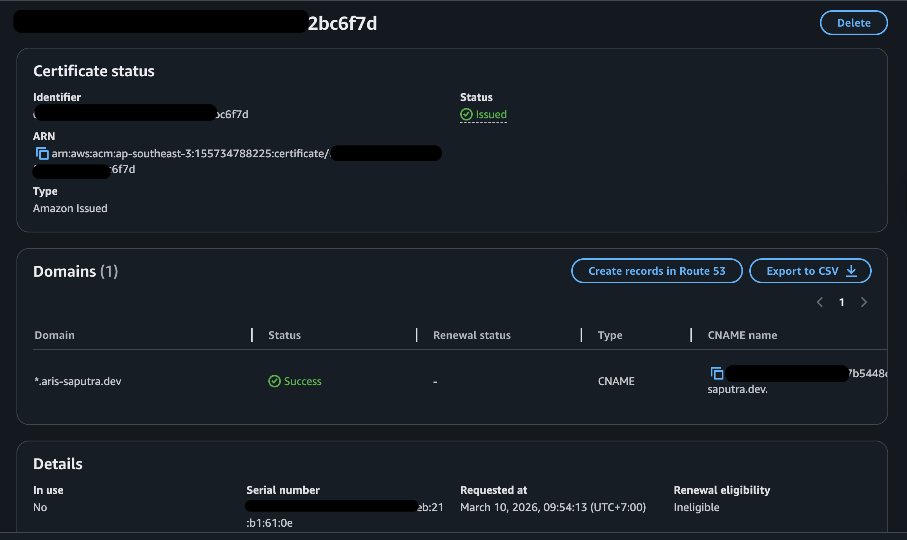
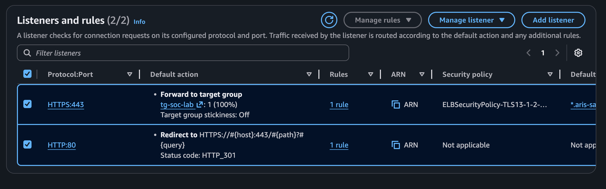
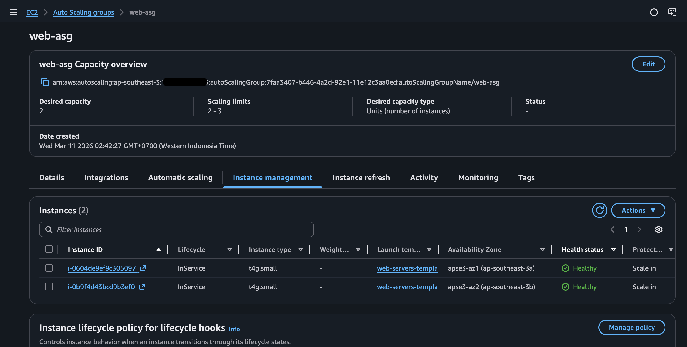
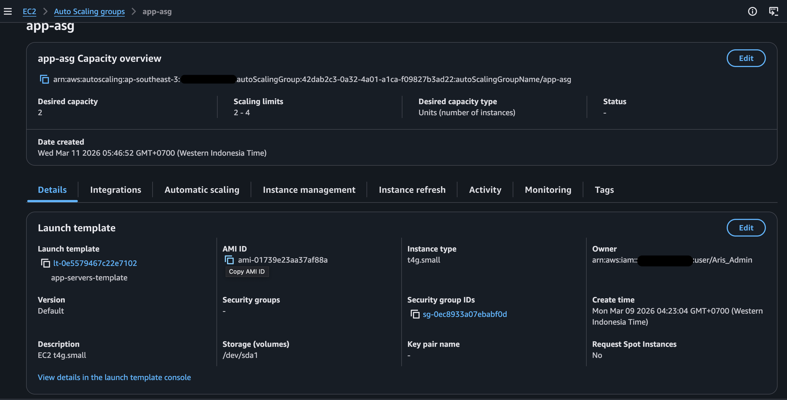
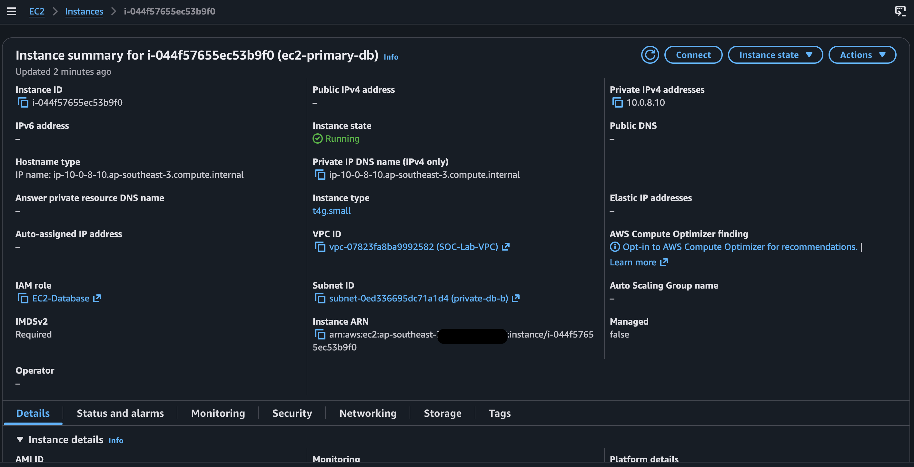
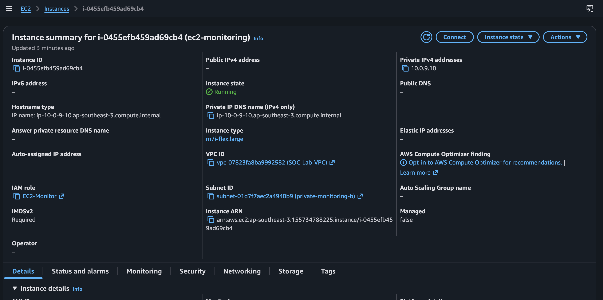

# Compute and Load Balancing Deployment

---

## Overview

I deployed a multi-tier application (web → app → DB) with monitoring in isolated subnets.

- Cost Optimization: Used Graviton (t4g) instances for ~20–40% cost savings compared to x86.
- Scalability: Auto Scaling is configured for the web and app tiers (min 2, desired 2, max 3 per AZ).


_Figure 1: Console view of all instances running_

## Digital Certificate

Before setting up the Application Load Balancer (ALB), I created a digital certificate. This certificate verifies domain identity and provides the public key used during the TLS handshake. I used AWS Certificate Manager (ACM) to generate and validate the certificate.

 \*_Figure 2: Preview digital certificate_

## Application Load Balancer

The Application Load Balancer handles the TLS handshake (TLS termination) using the certificate created earlier.

| Attribute                 | Value                               |
| ------------------------- | ----------------------------------- |
| Tag Name                  | app-load-balancer                   |
| VPC                       | SOC-Lab-VPC                         |
| IP                        | Type IPv4                           |
| AZ and Subnet             | ap-southeast-3a/public-a            |
|                           | ap-southeast-3b/public-b            |
| Security Group            | SG-App-Load-Balancer                |
| Listener                  | HTTPS/443 (forward to target group) |
|                           | HTTP/80 (redirect to HTTPS)         |
| Target Group              | tg-web-servers                      |
| Cross-zone Load Balancing | Enabled                             |

Additional Configuration:

- Security Policy: `ELBSecurityPolicy-TLS13-1-2-Res-PQ-2025-09`
- Certificate: `*.aris-saputra.dev` (from ACM)

 \*_Figure 3: Preview ALB listener and rule_

## Web Tier Instances

To provide fault tolerance, I created an Auto Scaling Group (ASG) for the web servers. First, I defined a Launch Template as the baseline configuration. Then, I configured the ASG parameters, including thresholds and subnets.

**Instance Template**

| Attribute      | Value                         |
| -------------- | ----------------------------- |
| Tag Name       | web-servers-template          |
| Instance Type  | t4g.small (2vCPU, 2GB Memory) |
| AMI            | Ubuntu Server 22.04 LTS (HVM) |
| Architecture   | 64-bit (ARM)                  |
| Storage        | 1 volume - 8GiB               |
| Security Group | sg-web-server                 |
| IAM Role       | EC2-Web-Server                |

**Auto Scaling Group**

| Attribute        | Value                                     |
| ---------------- | ----------------------------------------- |
| Name             | web-asg                                   |
| Template         | web-server-template                       |
| AZ/Subnet        | ap-southeast-3a/private-web-a             |
|                  | ap-southeast-3b/private-web-b             |
| Desired Capacity | 2                                         |
| Min Capacity     | 2                                         |
| Max Capacity     | 3                                         |
| Health Check     | ELB (Elastic Load Balancing)              |
| Min Healthy %    | 80%                                       |
| Notifications    | SNS: web-lab-sns (admin@aris-saputra.dev) |

 \*_Figure 4: Preview web auto-scaling group_

## App Tier Instances

**Instance Template**

| Attribute      | Value                         |
| -------------- | ----------------------------- |
| Tag Name       | app-servers-template          |
| Instance Type  | t4g.small (2vCPU, 2GB Memory) |
| AMI            | Ubuntu Server 22.04 LTS (HVM) |
| Architecture   | 64-bit (ARM)                  |
| Storage        | 1 volume - 10GiB              |
| Security Group | sg-app-server                 |
| IAM Role       | EC2-App-Server                |

**Auto Scaling Group**

| Attribute              | Value                                     |
| ---------------------- | ----------------------------------------- |
| Name                   | app-asg                                   |
| Template               | app-server-template                       |
| AV/Subnet              | ap-southeast-3a/private-app-a             |
|                        | ap-southeast-3b/private-app-b             |
| Desired Capacity       | 2                                         |
| Min disired capacity   | 2                                         |
| Max disired capacity   | 3                                         |
| Health check           | EC2 health check                          |
| Min healthy percentage | 80%                                       |
| Notifications          | SNS: app-lab-sns (admin@aris-saputra.dev) |

 \*_Figure 5: Preview app auto scaling group_

## Database

| Attribute      | Primary database              | Replica Database              |
| -------------- | ----------------------------- | ----------------------------- |
| Tag Name       | ec2-primary-db                | ec2-replica-db                |
| AZ/Subnet      | ap-southeast-3a(private-db-a) | ap-southeast-3b(private-db-b) |
| IPv4v          | 10.0.4.10                     | 10.0.8.10                     |
| Instance Type  | t4g.small, 2vCPU, 2GB Memory  | t4g.small, 2vCPU, 2GB Memory  |
| AMI            | Ubuntu server 22.04 LTS(HVM)  | Ubuntu server 22.04 LTS(HVM)  |
| Architecture   | 64-bit(ARM)                   | 64-bit(ARM)                   |
| Key Pair       | -                             | -                             |
| Storage        | 1 volume - 10 GiB (root)      | 1 volume - 10 GiB (root)      |
|                | 1 volume - 25 GiB (EBS)       | 1 volume - 25 GiB (EBS)       |
| Security Group | sg-database                   | sg-database                   |

 \*_Figure 6: Preview ec2-primary-db_

For the initial database setup, I chose EC2 instances to maintain full control over the MySQL configuration. I implemented manual replication using separate EBS volumes for data (25 GiB).

## Monitoring / SIEM Instance

| Attribute      | Value                             |
| -------------- | --------------------------------- |
| Tag Name       | ec2-security-monitoring-b         |
| IPv4v          | 10.0.9.10                         |
| Instance Type  | m7i-flex.large, 2vCPU, 8GB Memory |
| AMI            | Ubuntu server 22.04 LTS(HVM)      |
| Architecture   | x86_64                            |
| Key Pair       | RSA, .pem                         |
| Storage        | 1 volume - 20 GiB (root)          |
|                | 1 volume - 100 GiB (data/logs)    |
| Security Group | sg-monitoring                     |

 \*_Figure 7: Preview console ec2-monitoring_

- Purpose: Host for Wazuh + Kibana and log processing.
- Log Collection: Agents on all instances send logs via TCP 1514/1515.
- Access: Primary access via AWS Systems Manager (SSM). Key pair access is intentionally enabled for SSH demonstration purposes.
- Key Security: The PEM key is stored in a secure directory with read-only permissions:

```
Bash
# Securing the SSH key
mv ~/Downloads/key.pem ~/.ssh/
chmod 400 ~/.ssh/key.pem
```

---

### Future improvements:

- Implement an Internal Load Balancer for the App Tier.
- Migrate the database to Amazon RDS Multi-AZ for managed high availability.
- Configure dynamic ASG scaling policies based on CPU utilization.
- Install the CloudWatch agent on all instances for granular metric collection.
