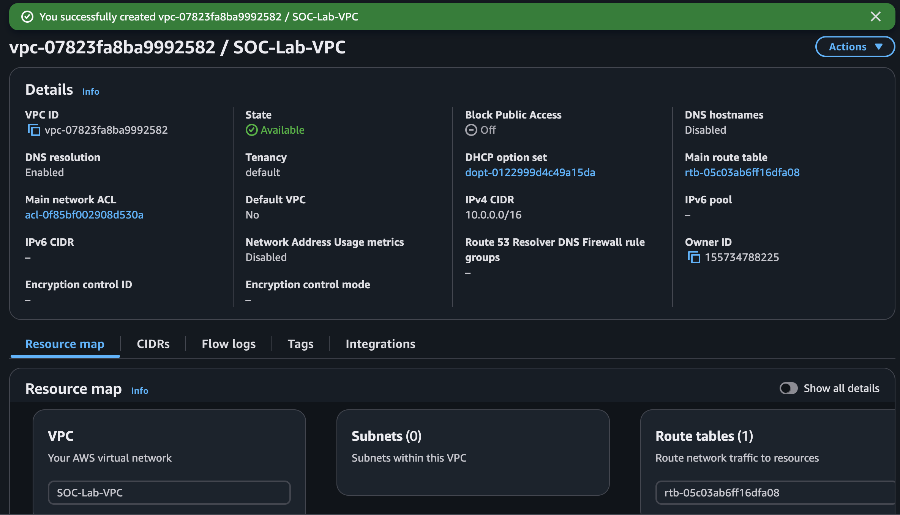
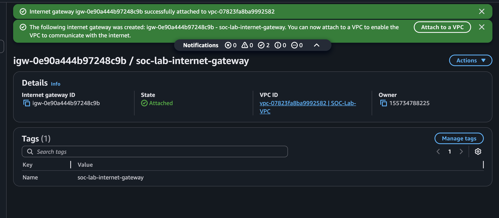
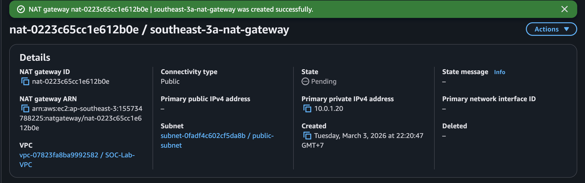

## Instance Launch & Configuration

All production instances launched in private subnets with:

- No public IP
- IAM role: AmazonSSMManagedInstanceCore + custom policies
- Access: AWS Systems Manager Session Manager (no bastion host)

This eliminates open SSH ports and provides audited access — key for SOC operations.

**VPC**

I've created VPC with tag name= SOC-Lab-VPC and IPv4 CIDR 10.0.1.0/16. To support Production environment I choose to use wide range of CIDR block, with /16 block this VPC can hold up to 65534 Host/Net. It will give enough ip for scalilbility and future defelopment.

**Internet Gateway**

Internet Gateway is AWS instance that handle igreess/outgreess of an VPC traffic. Without internet gateway all instances within VPC wouln't be able to communicate with the internet. I've created IGW and attach it to SOC-Lab-VPC.

**NAT Gateway**

I've created NAT Gateway in my public subnet, add my privte IPv4 address (10.0.1.20) and Elastic IP. NAT gateway will allow my instances in my private subnets to access the internet as outbound only, usefull for downloading or update update.

