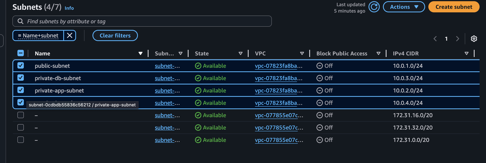

**Subnets**

For poper segmentation I've seperated Public and Private subnet Public subnet will be used to hold internet-facing instances. Pivate subnets will hold instances without internet indound accesses. With detail:

- Public subnet (10.0.1.0/24) - (ALB and NAT gateway).
- Privete Web/App subnets (10.0.2.0/24) - responsible to hold Web/App server. **Recomended to seperate Web and App layer for production**. I've simplified it to save costs/time.
- Private Database subnet (10.0.3.0/24) - Dedicated subnet to hold database instances.
- Monitoring subnet (10.0.4.0/24) - private subnet for central Monitoring and Incident Response instance.

