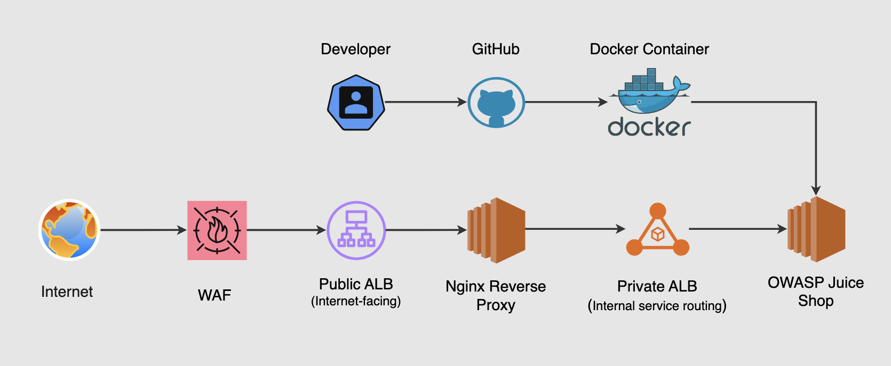
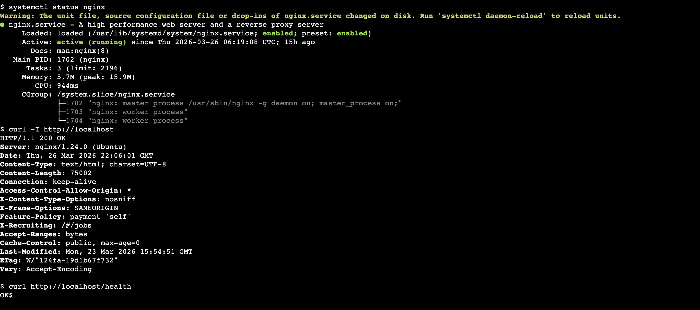
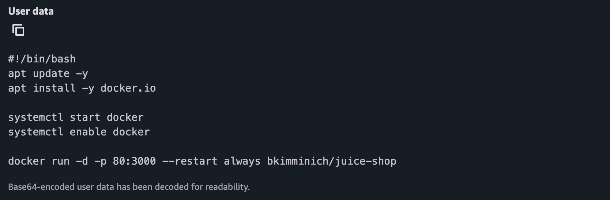
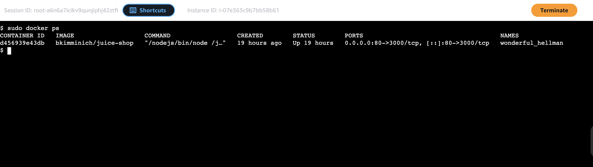
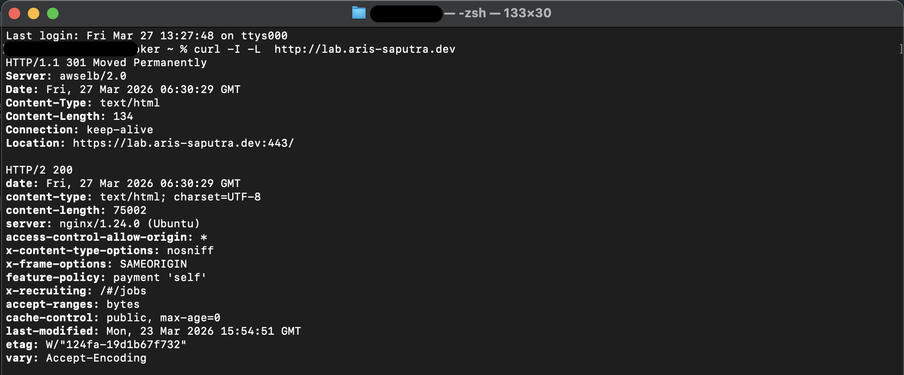
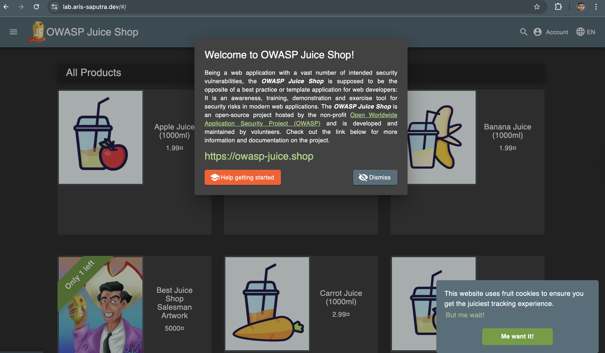

# Web Server Configuration and App Deployment

 \*_Figure 1: High-level user and developer flow through the environment._

---

## Overview

This section documents the deployment of a secure, scalable web tier using Nginx as a reverse proxy and the OWASP Juice Shop as the backend application.

**Nginx Reverse Proxy**
I placed Nginx behind the internet-facing Application Load Balancer (ALB) to add a dedicated Layer 7 control point. This provides:

- Fine-grained request routing and header manipulation
- Enhanced visibility for SOC monitoring (access logs, custom headers)
- An additional security layer (hiding backend details, basic hardening)
- Better separation between public exposure and internal services

**Juice Shop Intro**
[OWASP Juice Shop](https://owasp.org/www-project-juice-shop/) is an intentionally vulnerable web application designed for security training, awareness, and red/blue team exercises. It contains realistic vulnerabilities aligned with the OWASP Top 10, making it ideal for:

- Simulating attack scenarios
- Validating detection rules
- Practicing incident response and log analysis in a controlled SOC environment

**Key facts**

- Initial release: 2014
- Lead developer: Björn Kimminich
- Programming stack: Node.js, Express, Angular, SQLite
- License: MIT
- Latest release: Version 19.1.1 (November 2025)

I've configured Nginx reverse proxy and deployed Juice Shop on my `app-asg` using docker container, this app will help me to simulate NOC operation and SOC monitoring simulation, which is perfect for this lab. This file is document of step-by-step how i deployed the app

---

## Nginx Reverse Proxy Configuration

Incoming traffic from the public ALB is forwarded to the Nginx reverse proxy instances, which then route requests to the internal ALB for backend service distribution.

To make the lab stable and realistic, the best approach is to configure Auto Scaling Group so that every new EC2 instance automatically install and start Nginx.
This is done using User Data in the Launch Template.

**Launch Template Configuration**

Add the Startup Script for the Launch template (User Data) used by the `web-asg`.

User Data:

```
#!/bin/bash

# Update system & install Nginx
apt update -y
apt install -y nginx

# Remove default config
rm -f /etc/nginx/sites-enabled/default

# Create custom Nginx reverse proxy config
cat <<EOF > /etc/nginx/sites-available/reverse-proxy
server {
    listen 80 default_server;
    listen [::]:80 default_server;
    server_name _;

    # Health check endpoint (for ALB)
    location = /health {
        access_log off;
        add_header Content-Type text/plain;
        return 200 'OK';
    }

    # Reverse proxy to internal ALB
    location / {
        proxy_pass http://internal-inner-load-balancer-2121773739.ap-southeast-3.elb.amazonaws.com;

        # Preserve original request details
        proxy_set_header Host \$host;
        proxy_set_header X-Real-IP \$remote_addr;
        proxy_set_header X-Forwarded-For \$proxy_add_x_forwarded_for;
        proxy_set_header X-Forwarded-Proto \$scheme;

        # Timeouts
        proxy_connect_timeout 60s;
        proxy_send_timeout 60s;
        proxy_read_timeout 60s;

        # Basic security hardening
        proxy_hide_header X-Powered-By;
    }
}
EOF

# Enable config
ln -sf /etc/nginx/sites-available/reverse-proxy /etc/nginx/sites-enabled/default

# Test config before restart (IMPORTANT)
nginx -t

# Restart Nginx
systemctl restart nginx
systemctl enable nginx
```

**Test the Nginx Reverse Proxy**


_\*Figure 2: Console test of Nginx service, reverse proxy, and health Console test of Nginx service, reverse proxy, and health endpoint._

- Check Nginx service (basic but critical)
  `systemctl status nginx` : active (running).
- Test reverse proxy (if it actually forwards to your backend)
  `curl -I http://localhost` : 200 OK.
- Test health endpoint (ALB dependency)
  `curl http://localhost/health` : OK.

---

## Juice App Deployment (Ubuntu)

Similar to the Nginx configuration on the web ASG, I configured the launch template for the application Auto Scaling Group. The container is exposed on port 80 and registered with the internal ALB target group, allowing seamless load balancing across application instances.

This way:

```
ASG launches EC2
      |
User Data script runs automatically
      |
Docker installs
      |
Juice Shop container starts
```

No manual installation is needed. Step-by-step:

**Step 1 — Edit the Launch Template**

Go to:

```
EC2
-> Launch Templates
-> Select the template (used by the app-asg)
-> Actions
-> Modify template
-> Advanced details
```

Find the User Data section.

**Step 2 — Add the Startup Script**


_Figure 3: Preview App Juice startup script_

What this script does:

| Step                     | Action            |
| ------------------------ | ----------------- |
| Update packages          | prepares system   |
| Install Docker           | container runtime |
| Start Docker             | enable service    |
| Run Juice Shop container | launch app        |

The flag: `--restart always` ensures the container restarts automatically if the server reboots.

**Step 3 — Save New Template Version**

After editing:

```
Create new template version
```

Then update the Auto Scaling Group to use the new version.

**Step 4 — Refresh the Instances**

Trigger instance replacement.

Options:

```
ASG → Instance Refresh
```

or terminate one instance manually.

When ASG launches a new instance:

```
EC2 starts
User Data script runs
Docker installs
Juice Shop container launches
```

**Step 5 — Verify the Container**

Connect to `app-asg` instance using AWS Systems Manager.

Run:

```bash
sudo docker ps
```

You should see something like:

_Figure 4: Console running container_

**Step 6 — Confirm Load Balancer Target Health**

Go to:

```
EC2
→ Target Groups
→ Targets
```

Your instance should become:

```
Healthy
```

because the container is serving traffic on:

```
port 80
```

---

## Overall Testing

Additionally, I verified end-to-end connectivity by sending requests through the public ALB DNS, confirming that traffic successfully flows through WAF → ALB → Nginx → Private ALB → Application.

**End-to-End Test**

From local machine:


_\*Figure 5: Console view Response headers from backend (juice app)_

`HTTP/1.1 200 OK`, This proves:
✔ WAF working
✔ Public ALB routing
✔ Nginx forwarding
✔ Private ALB routing
✔ App responding

**Browser Test (real user simulation)**

Open in browser:


_\*Figure 6: Preview OWASP Juice Shop_

---

## Manual deployment Vs Auto Script

Manual deployment introduces inconsistency and does not align with Auto Scaling environments, where instances are ephemeral. In contrast, using Docker with User Data ensures that each instance is provisioned identically at launch, enabling stateless, repeatable, and scalable deployments.

| Manual deployment | Problem                         | Automation script    | Benefit          |
| ----------------- | ------------------------------- | -------------------- | ---------------- |
| Manual install    | lost when ASG replaces instance | Docker container     | lightweight      |
| npm build         | high memory usage               | User Data automation | consistent       |
| long install time | slow scaling                    | ASG replacement      | instant recovery |
