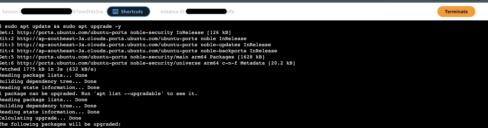
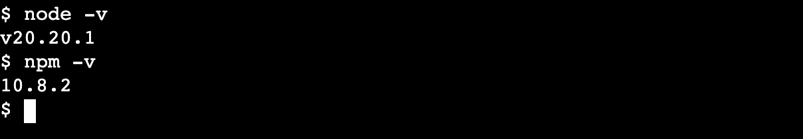

# OWASP Juice Shop App Deployment

## Overview

I've deployed Juice Shop on my server, this app will help me to simulate NOC operation and SOC monitoring simulation, which is perfect for this lab. This file is document of step-by-step how i deployed the app

**Introduction**
OWASP Juice Shop is an open-source, intentionally vulnerable web application developed under the Open Worldwide Application Security Project. It serves as a flagship platform for security education, penetration testing practice, and tool benchmarking, incorporating the full spectrum of vulnerabilities from the OWASP Top Ten and beyond. Its realistic e-commerce interface and gamified challenges make it one of the most advanced training tools in web application security.

**Key facts**

- Initial release: 2014
- Lead developer: Björn Kimminich
- Programming stack: Node.js, Express, Angular, SQLite
- License: MIT
- Latest release: Version 19.1.1 (November 2025)

**Example Traffic Flow**

```
User
  |
HTTPS
  |
AWS WAF
  |
Application Load Balancer
  |
Nginx (Web Tier)
  |
Juice Shop App (App Tier)
  |
SQLite Database
```

## Deployment (Ubuntu)

**1. Connect to the EC2 Server**

For connection to `ec2-app-servers` I used SSM instead of SSH.

```
IAM users (aris_admin) > AWS Systems Manager > Explore nodes > ec2-app-servers > connect > start terminal session
```

**2. Update the Server**
Updating the system ensures the latest security patches are installed.

```
$ sudo apt update && sudo apt upgrade
```

 \*_Figure 1: Console view ec2-app-server CLI_

**3. Install Node.js**

Node.js is required because Juice Shop is a Node application.
But before installing Node.js, I need to installed Required Prerequisites first.

```
$ sudo apt install -y curl ca-certificates gnupg
$ curl -fsSL https://deb.nodesource.com/setup_20.x | sudo -E bash -
```

These packages allow the system to download the Node.js installer and configures the NodeSource repository for Node.js 20 LTS.

```
$ sudo apt install -y nodejs
```

This installs Node.js runtime and npm package manager

 \*_Figure 2: Preview Node.js and Npm version_

**4. Install Git**

If you don't have Git installed yet, run commad :

```
$ sudo yum install git -y
```

And Clone the repository:

```
$ git clone https://github.com/juice-shop/juice-shop.git

"Make sure youre in home directory (e.g. /home/ssm-user)"
```

Then enter the directory:

```
$ cd juice-shop
```

**5. Install Application Dependencies**

Install required packages:

```
npm install
```

This installs everything needed for the application to run.

 \*_Figure 3: Console view CLI npm install command_

**7. Start the Application**

Run the server:

npm start

You should see output similar to:

Server listening on port 3000

The app now runs on:

http://localhost:3000
**8. Allow Traffic From the Load Balancer**

Your security group should allow:

Port 3000
Source: ALB security group

Traffic flow becomes:

User
↓
WAF
↓
ALB (port 80/443)
↓
EC2 (port 3000)
**9. Configure the Target Group**

In your Application Load Balancer:

Target group settings:

Protocol: HTTP
Port: 3000
Health check path: /

The load balancer will forward traffic to the application.

This uses:

Elastic Load Balancing

**10. Make the App Run Automatically (Production Practice)**

In real servers, apps run using a process manager like:

PM2

Install it:

sudo npm install pm2 -g

Run the app:

pm2 start npm --name juice-shop -- start

Save startup configuration:

pm2 startup
pm2 save

Now the application auto-starts after reboot.

**11. Logging for Your SOC Lab**

The app will generate logs you can monitor with:

Amazon CloudWatch

Amazon GuardDuty

AWS WAF

You can simulate attacks and observe:

WAF logs
ALB logs
Application logs
VPC Flow Logs

This creates real SOC investigation scenarios.
