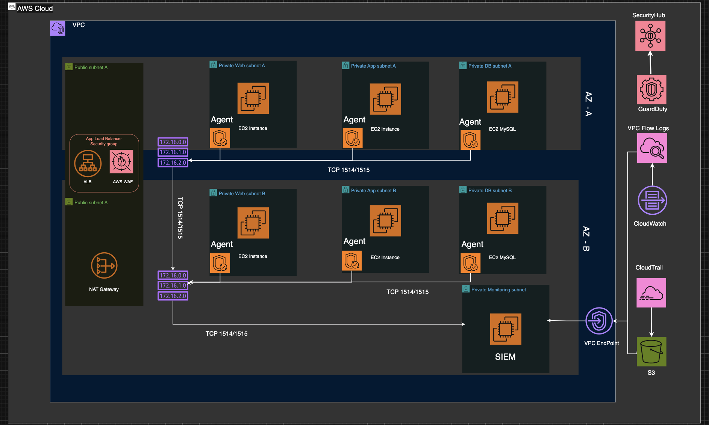
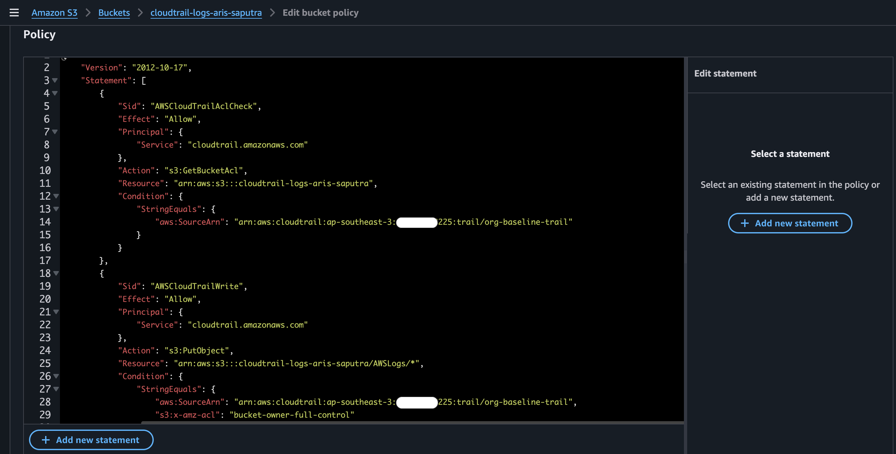

# Logging Baseline Configuration

  
_Figure 1: Logging and monitoring data flow in the lab environment_

---

## Overview

This section implements the foundational logging and monitoring layer for the cloud environment.

The design provides visibility into infrastructure changes, network traffic, application access, and host-level activity. It supports both Cloud NOC (availability and performance monitoring) and SOC (security event detection and investigation) operations.

A layered approach ensures comprehensive coverage while keeping the architecture simple and scalable. All critical logs feed into centralized tools (CloudWatch and Wazuh) to enable future correlation and alerting.

**Logging Layers**

- Cloud Audit: `AWS CloudTrail` – Tracks API activity and configuration changes
- Network: `VPC Flow Logs` – Captures traffic metadata
- Web/Application: `ALB Access Logs` – Records HTTP requests to OWASP Juice Shop
- Host: `Wazuh Agent` – Collects OS logs, authentication, and file integrity
- Monitoring: `Amazon CloudWatch` – Provides metrics, dashboards, and basic alarms

---

## Implementation

#### 1. AWS CloudTrail (Infrastructure Auditing)

Purpose: Create a centralized, tamper-resistant audit trail that records:

- All API activity (who did what, when, from where)
- Security-relevant events for SOC detection
- Compliance-ready logs.

**Flow:**

    AWS Account Activity
            |
    CloudTrail (Management + Data Events)
            |
    S3 Bucket (log archive - immutable)
            |
    CloudWatch Logs (real-time monitoring)
            |
    SNS / Alerts (optional)

**What I did**:

- Created a multi-region trail named `management-trail`.
- Enabled logging for Read and Write management events.
- Delivered logs to a dedicated S3 bucket with log file validation enabled.
- Integrated with CloudWatch Logs for real-time monitoring.

---

- Created dedicated `cloudtrail-logs-aris-saputra` S3 Bucket (Log Storage) with :
  - Versioning, Block Public Access, and Server-side encryption (SSE-S3) enabled. - Policy:
    
    _Figure 2: Console Preview S3 Buckets policy._

#### 2. VPC Flow Logs (Network Visibility)

Purpose: Capture accepted and rejected IP traffic for anomaly detection.

**What I did**:

- Enabled flow logs on the VPC and both public/private subnets.
- Set filter to All traffic with 1-minute aggregation.
- Delivered logs to CloudWatch Logs group `/aws/vpc/flowlogs`.

#### 3. Application Load Balancer Access Logs

Purpose: Track every HTTP request reaching the Juice Shop application.

**What I did**:

- Enabled access logging on the ALB.
- Configured delivery to a dedicated S3 bucket.

#### 4. Wazuh Agent on EC2 Instances (Host Logging)

Purpose: Collect system, authentication, and integrity monitoring logs from application instances.

**What I did**:

- Added Wazuh agent installation and registration directly into the Launch Template User Data script.
- This ensures every new instance launched by the Auto Scaling Group automatically connects to the Wazuh manager.

**Key snippet from User Data**:

```bash
# Wazuh Agent Installation
curl -sO https://packages.wazuh.com/4.x/wazuh-agent-4.x.deb
sudo WAZUH_MANAGER="10.0.2.XX" WAZUH_AGENT_NAME="juice-shop-asg" dpkg -i ./wazuh-agent-4.x.deb
sudo systemctl enable --now wazuh-agent

```

#### 5. Verification

- CloudTrail: Confirmed events (e.g., IAM changes, EC2 actions) appear in the CloudWatch log group.
- VPC Flow Logs: Generated traffic to Juice Shop and queried rejected connections using Logs Insights.
- Wazuh: Verified agents show as Active in the Wazuh dashboard after ASG instance refresh.
- CloudWatch: Created basic dashboards for EC2 CPU, ALB requests, and ASG health.

---

## Key Takeaways

- This logging setup is optimized for learning and demonstration purposes. To control costs, VPC Flow Logs and CloudWatch log retention are limited, and resources are stopped when not in active use.
- Implemented automated, consistent logging across dynamic infrastructure (Auto Scaling Group) using Launch Template User Data — a practical skill for real production environments.
- This setup gives immediate value for NOC (resource health monitoring) and prepares strong SOC capabilities (investigating unauthorized changes via CloudTrail or suspicious traffic via VPC Flow Logs).
- Main challenge: Coordinating Security Group rules for Wazuh communication (TCP 1514/1515). Resolved by creating dedicated ingress rules from the app security group.
- Production improvement idea: Forward CloudTrail and VPC Flow Logs into - Wazuh for centralized analysis and custom detection rules (planned for Phase 3/4).

This logging baseline completes the core visibility layer of Phase 1 and directly supports the project goal of simulating real Cloud Security Operations.
